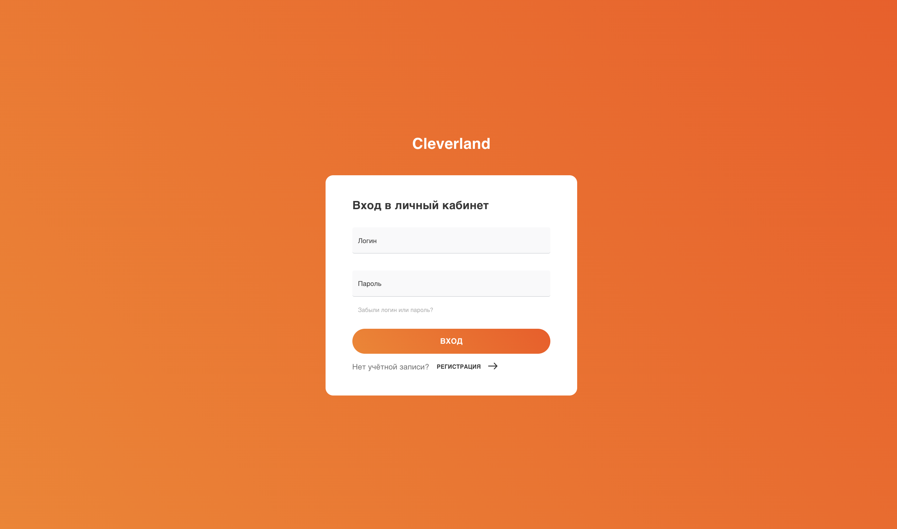
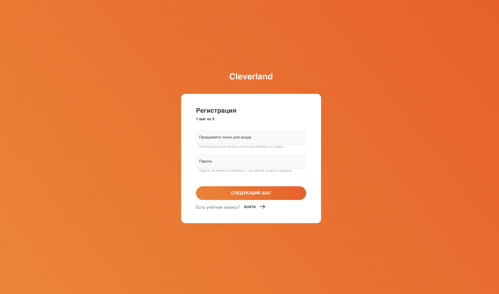
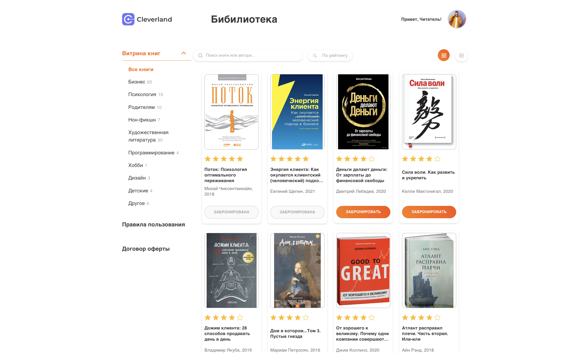
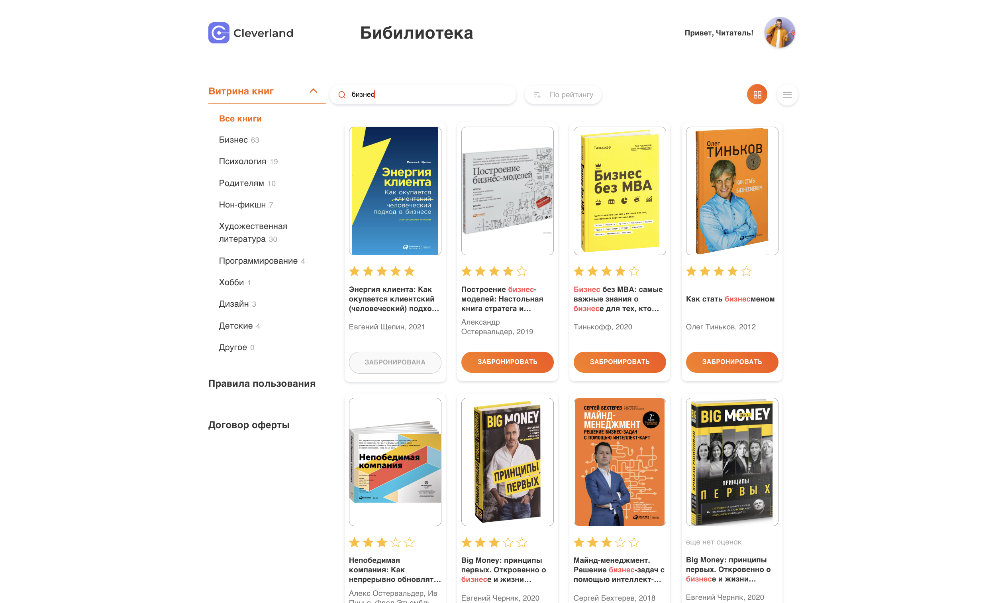
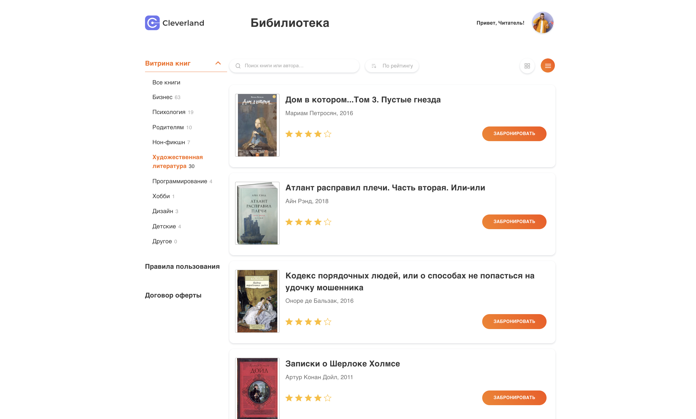
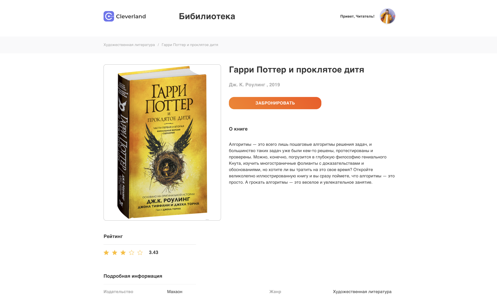
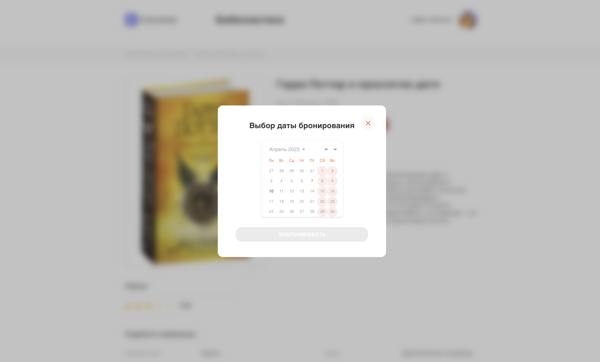
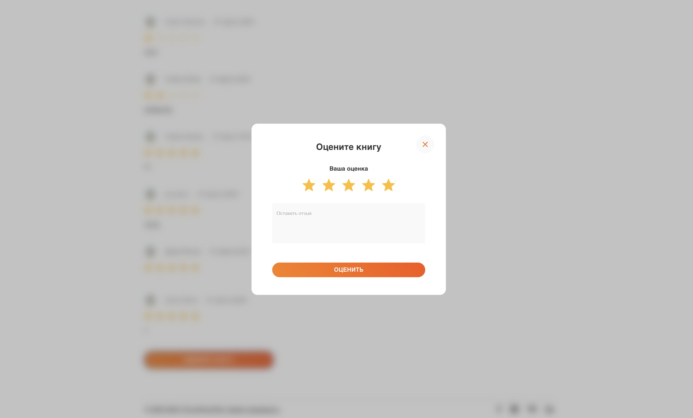

[![Contributors][contributors-shield]][contributors-url]
[![Forks][forks-shield]][forks-url]
[![Stargazers][stars-shield]][stars-url]
[![LinkedIn][linkedin-shield]][linkedin-url]

<a name="readme-top"></a>

<br />
<div align="center">
  <a href="https://annabr01.github.io/react-cleverland/">
    
  </a>

  <h3 align="center">Cleverland </h3>
 <div align="center" >(in progress: account page and animation effects)  </div>

  <p align="center">
       <br />

<a href="https://annabr01.github.io/react-cleverland/" target="_blank">Click to see result 👀</a>

  </p>
</div>

<details>
  <summary>Table of Contents</summary>
  <ol>
    <li>
      <a href="#about-the-project">About The Project</a>
      <ul>
        <li><a href="#built-with">Built With</a></li>
      </ul>
    </li>
    <li>
      <a href="#getting-started">Getting Started</a>
      <ul>
        <li><a href="#prerequisites">Prerequisites</a></li>
        <li><a href="#installation">Installation</a></li>
      </ul>
    </li>
    <li><a href="#usage">Usage</a></li>
    <li><a href="#contact">Contact</a></li>
  </ol>
</details>

## About The Project

A web application, which provides you with possibility to booking books, providing a several more features alongside which are going to be described below.

<p align="right">(<a href="#readme-top">back to top</a>)</p>

### Built With

This section should list any major frameworks/libraries used to bootstrap your project. Leave any add-ons/plugins for the acknowledgements section. Here are a few examples.

- [![React][react.js]][react-url]
- [![styled-components][styled-components]][styled-components-url]
- [![React Router][reactrouter.com]][react-router-url]
- [![Redux Toolkit][redux-toolkit.js.org]][redux-url]
- [![React Hook Form][react-hook-form.com]][react-hook-form-url]
<!-- - [![Framer Motion][framer.com]][framer-url] -->

<p align="right">(<a href="#readme-top">back to top</a>)</p>

## Getting Started

### Prerequisites

This is an example of how to list things you need to use the software and how to install them.

### Installation

2. Clone the repo
   ```sh
   git clone https://github.com/AnnaBR01/react-cleverland.git
   ```
3. Install packages
   ```sh
   yarn
   ```
   <p align="right">(<a href="#readme-top">back to top</a>)</p>

<!-- USAGE EXAMPLES -->

## Usage

Upon entering the site you will land at the sign in. If you don't have an account, register by going to the registration page using the link (then sign in).


<br /><br />


After registration you get to the main page where you see all the books of the library.



On the Home page you can use a search, also filter by rating and categories.



On the main page you can change the view of books.



Each book has its own dedicated page, which provides you with all the relevant info on the particular book.



On the detail or home page you can booking, rate the book or cancel booking.


<br /><br />


Try to do it! <a href="https://annabr01.github.io/react-cleverland/" target="_blank"> 👀</a>

<p align="right">(<a href="#readme-top">back to top</a>)</p>

## Contact

Ann Britkina - [@Ann_Britkina](telegram) - [https://www.linkedin.com/in/ann-britkina-a4b08b242/](linkedin)

Project Link: [https://github.com/AnnaBR01/react-cleverland](https://github.com/AnnaBR01/react-cleverland)

<p align="right">(<a href="#readme-top">back to top</a>)</p>

[contributors-shield]: https://img.shields.io/github/contributors/AnnaBR01/react-cleverland.svg?style=for-the-badge
[contributors-url]: https://github.com/AnnaBR01/react-cleverland/graphs/contributors
[forks-shield]: https://img.shields.io/github/forks/AnnaBR01/react-cleverland.svg?style=for-the-badge
[forks-url]: https://github.com/AnnaBR01/react-cleverland/network/members
[stars-shield]: https://img.shields.io/github/stars/AnnaBR01/react-cleverland.svg?style=for-the-badge
[stars-url]: https://github.com/AnnaBR01/react-cleverland/stargazers
[linkedin-shield]: https://img.shields.io/badge/-LinkedIn-black.svg?style=for-the-badge&logo=linkedin&colorB=555
[linkedin-url]: https://www.linkedin.com/in/ann-britkina-a4b08b242/
[typescriptlang.org]: https://img.shields.io/badge/-Typescript-blue?style=for-the-badge&logo=typescript&logoColor=white
[typescript-url]: https://www.typescriptlang.org/
[react.js]: https://img.shields.io/badge/React-20232A?style=for-the-badge&logo=react&logoColor=61DAFB
[react-url]: https://reactjs.org/
[axios-http.com]: https://img.shields.io/badge/-axios-671ddf?style=for-the-badge&logo=axios&logoColor=white
[axios-url]: https://axios-http.com/ru/docs/intro
[redux-toolkit.js.org]: https://img.shields.io/badge/-redux--toolkit-764abc?style=for-the-badge&logo=redux&logoColor=white
[redux-url]: https://redux-toolkit.js.org/
[react-hook-form.com]: https://img.shields.io/badge/-react--hook--form-1e2a4a?style=for-the-badge&logo=react-hook-form&logoColor=ec5990
[react-hook-form-url]: https://react-hook-form.com/

<!-- [framer.com]: https://img.shields.io/badge/-framer--motion-DD0031?style=for-the-badge&logo=framer&logoColor=black
[framer-url]: https://www.framer.com/ -->

[reactrouter.com]: https://img.shields.io/badge/-react--router-563D7C?style=for-the-badge&logo=react-router&logoColor=white
[react-router-url]: https://reactrouter.com/
[styled-components]: https://img.shields.io/badge/-styled--components-35495E?style=for-the-badge&logo=styled-components&logoColor=pink
[styled-components-url]: https://styled-components.com/
